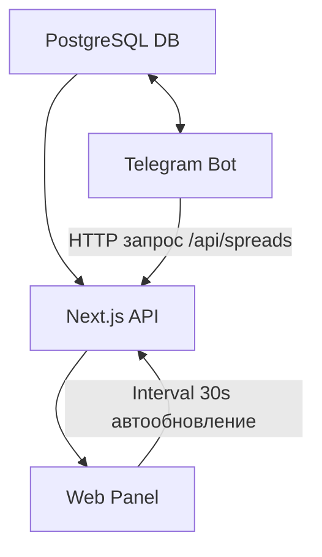

# 🪙 CryptoArb-WebBot  
**Интеллектуальный арбитражный веб-бот с Telegram-интеграцией и автообновляемой панелью**

<p align="center">
  <a href="https://cryptoarb-webbot.railway.app" target="_blank">
    
  </a>
  <a href="https://t.me/cryptoarb_web_bot" target="_blank">
    
  </a>
  <a href="https://github.com/username/cryptoarb-webbot" target="_blank">
    
  </a>
</p>

<p align="center">
  
  
  
  
  
  
</p>

---

## 📖 Описание

**CryptoArb-WebBot** — это комплексная система для мониторинга криптоарбитражных возможностей в реальном времени.  
Проект объединяет **Next.js веб-панель** и **Telegram-бота**, синхронизированных через общую базу данных PostgreSQL.  
Пользователи получают автоматические уведомления при обнаружении выгодных спредов между биржами.

---

## ⚙️ Основные возможности

### 💻 Веб-панель
- Таблица активных торговых пар (только с актуальными спредами)  
- Столбиковый график Recharts  
- Автообновление данных каждые 30 секунд  
- Переключение темы 🌙 / ☀️  
- Перевод интерфейса 🇷🇺 / 🇬🇧  
- История уведомлений (24 часа)  
- Панель пользователей (добавление друзей)  
- Виджет статуса бота “🟢 Активен / 🔴 Отключён”  
- Современный адаптивный дизайн (Tailwind + Dark/Light UI)

### 🤖 Telegram-бот
- Находит арбитражные пары между биржами  
- Исключает пары с приостановленным вводом/выводом  
- Уведомляет, если спред > **1%**  
- Не спамит — одно уведомление до исчезновения спреда  
- Ведёт историю уведомлений в базе данных  
- Команды: `/start`, `/help`, `/panel`  
- Работает автономно в фоне (Polling)

---

## 🧩 Архитектура



---

## 🧠 Технологический стек

| Компонент | Технологии |
|------------|-------------|
| Frontend | Next.js 14, React 18, TailwindCSS, Recharts, i18next |
| Backend | Node.js (API Routes), Prisma ORM |
| Bot | Telegraf.js |
| Database | PostgreSQL |
| DevOps | Docker, Railway, GitHub Actions |
| Design | Tailwind + Light/Dark Themes |

---

## 🧱 Структура проекта

```
cryptoarb-webbot/
├── web/                     # Веб-интерфейс (Next.js)
├── bot/                     # Telegram-бот (Telegraf)
├── prisma/                  # ORM-схема Prisma
├── docs/                    # Документация проекта
│   ├── LOCAL_SETUP.md
│   ├── DEPLOY_RAILWAY.md
│   ├── ARCHITECTURE.md
│   └── API_REFERENCE.md
├── docker-compose.yml       # Локальный запуск
└── .github/workflows/       # CI/CD деплой
```

---

## 🧰 Запуск проекта

### 🔧 Локально
```bash
docker-compose up --build
```
Затем открой:  
👉 [http://localhost:3000](http://localhost:3000)

### ☁️ Деплой на Railway
Подробная инструкция: [docs/DEPLOY_RAILWAY.md](./docs/DEPLOY_RAILWAY.md)

---

## 🧪 API эндпоинты

| Endpoint | Метод | Описание |
|-----------|--------|-----------|
| `/api/spreads` | GET | Список активных пар и спредов |
| `/api/status` | GET | Статус бота и панели |
| `/api/notifications` | GET | История уведомлений (24ч) |
| `/api/users` | GET | Пользователи |
| `/api/add-friend` | POST | Добавление друга |
| `/api/settings` | POST | Настройки темы и языка |

📘 Подробнее: [docs/API_REFERENCE.md](./docs/API_REFERENCE.md)

---

## 🚀 Особенности
- Полностью автоматический деплой (GitHub → Railway)  
- Минимальная задержка данных  
- Универсальный дизайн под desktop и mobile  
- Безопасное хранение токенов (ENV + Prisma)  
- Поддержка мультиязычности и тем  

---

## 🧩 Лицензия
Проект распространяется под лицензией **MIT**.  
Свободно используйте, дорабатывайте и деплойте под свои нужды.
